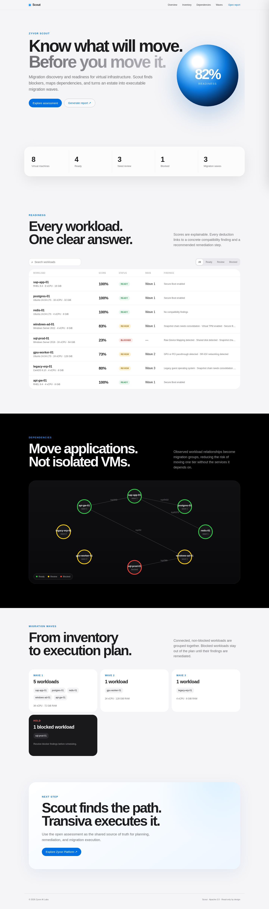

# Zyvor Scout

**Migration discovery and readiness before migration risk.**

Zyvor Scout is an Apache-2.0, read-only assessment tool for infrastructure teams planning migrations from virtualized environments to KVM/KubeVirt and other open platforms. It discovers or imports VM inventory, evaluates compatibility, explains blockers, maps workload dependencies, groups workloads into migration waves, and serves a polished local dashboard from one Go binary.

> Scout assesses and plans. It does **not** modify source workloads or execute migrations.

## Why Scout

Migration projects often begin with spreadsheets that hide the hard parts: RDM/shared disks, vTPM, Secure Boot, passthrough devices, snapshot chains, legacy guests, and application dependencies. Scout turns those facts into an explainable readiness score and an execution-oriented plan.

### Included in v0.1.0

- Read-only demo and VMware vCenter REST discovery
- Strict JSON inventory import format
- Explainable compatibility rule engine
- Ready / Review / Blocked classification
- Dependency graph
- Connected-workload migration waves
- Portable HTML assessment report
- Zyvor-branded responsive dashboard embedded into the binary
- JSON API for integrations
- Security headers and localhost-by-default web binding
- Docker / Podman packaging (Compose + Quadlet)
- Remote systemd deploy + smoke (`scripts/deploy-remote.sh`)
- Helm chart and Kustomize manifests
- Unit and API tests
- GitHub Actions CI
- Apache-2.0 license

## Screenshot



## Quick start

Requires Go 1.23+.

```bash
git clone https://github.com/zyvorai/scout.git
cd scout
make build

# Generate a safe demo inventory
./bin/scout scan --source demo --out scout.json

# Print machine-readable assessment
./bin/scout assess --file scout.json

# Open the local dashboard
./bin/scout serve --file scout.json
```

Visit `http://127.0.0.1:18447`.

Generate a standalone report:

```bash
./bin/scout report --file scout.json --out report.html
```

## VMware vCenter discovery

Scout includes a dependency-free vCenter REST connector that authenticates with an API session and enumerates VMs. v0.1.0 intentionally treats fields that are not returned by the basic VM endpoint as unknown rather than guessing them. Rich hardware/guest collection is on the roadmap.

Prefer credentials through environment variables so passwords do not land in shell history:

```bash
export VCENTER_URL='https://vcenter.example.com'
export VCENTER_USERNAME='administrator@vsphere.local'
export VCENTER_PASSWORD='...'

./bin/scout scan --source vmware --out scout.json
```

For lab systems with private PKI only:

```bash
./bin/scout scan --source vmware --insecure --out scout.json
```

`--insecure` disables TLS certificate verification and should not be used in production.

## How scoring works

Every VM begins at 100. Rules emit one of three finding levels:

- **info** — context worth preserving; no readiness penalty by default
- **warning** — needs review or remediation
- **blocker** — excludes the workload from migration waves until resolved

Built-in rules currently inspect encryption, RDM, shared disks, vTPM, Secure Boot, snapshot depth, GPU/PCI passthrough, SR-IOV, USB passthrough, guest tools, firmware mode, and legacy operating systems.

Rules live in `internal/engine/engine.go` and are intentionally simple to extend.

## Architecture

```text
       discovery / JSON import
                │
                ▼
           Inventory Model
                │
        ┌───────┴────────┐
        ▼                ▼
  Compatibility       Dependency
     Engine              Graph
        │                │
        └───────┬────────┘
                ▼
        Migration Waves
                │
        ┌───────┴──────────┐
        ▼                  ▼
   JSON API            HTML Report
        │
        ▼
 Embedded Web Dashboard
```

See [docs/ARCHITECTURE.md](docs/ARCHITECTURE.md) for package boundaries and extension points.

## API

When `scout serve` is running:

| Method | Endpoint | Purpose |
|---|---|---|
| GET | `/api/v1/healthz` | Liveness |
| GET | `/api/v1/inventory` | Source inventory |
| GET | `/api/v1/assessments` | Per-VM readiness |
| GET | `/api/v1/summary` | Aggregate readiness |
| GET | `/api/v1/graph` | Dependency graph |
| GET | `/api/v1/report` | Portable HTML report |
| POST | `/api/v1/analyze` | Analyze supplied inventory without persisting it |

See [docs/API.md](docs/API.md).

## Development

```bash
make test
make vet
make build
make report
```

Direct commands:

```bash
go test -race ./...
go vet ./...
go build ./cmd/scout
```

## Deploy

```bash
# Podman or Docker (auto-detects)
make container-up
# or: ./scripts/container.sh up --build

# Remote systemd (cross-compile + SSH + smoke)
./scripts/deploy-remote.sh <host> [user]

# Smoke an existing instance
SCOUT_URL=http://<host>:18447 ./scripts/smoke-remote.sh

# Kubernetes
kubectl apply -k deploy/k8s

# Helm
helm upgrade --install scout deploy/helm/scout -n scout --create-namespace \
  --set-file inventory.json=./scout.json
```

Details: [docs/DEPLOY.md](docs/DEPLOY.md).

## Security model

- Source-side operations are read-only.
- vCenter credentials are kept in memory and never written to the inventory or report.
- The server binds to `127.0.0.1:18447` by default.
- Requests have conservative timeouts and an 8 MiB analysis-body limit.
- The dashboard ships with CSP, frame, MIME-sniffing, referrer, and permissions headers.
- Put Scout behind authenticated TLS termination before exposing it to a network.

Read [SECURITY.md](SECURITY.md) before reporting vulnerabilities.

## Project direction

The intended open-source boundary is **discovery + assessment + dependency planning**. Execution systems can consume Scout's JSON output without making Scout responsible for cutover or source mutation.

Planned areas include richer vSphere hardware collection, libvirt/OpenStack/Hyper-V discovery, guest inspection adapters, traffic-derived dependency input, compatibility rule packs, signed assessment bundles, and export adapters for migration orchestrators.

See [docs/ROADMAP.md](docs/ROADMAP.md).

## License

Apache License 2.0. See [LICENSE](LICENSE).

Copyright © 2026 Zyvor AI Labs.
