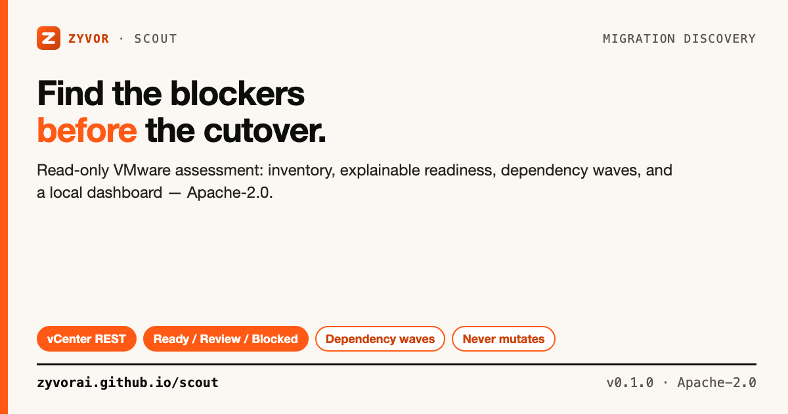

# Scout

[](https://github.com/zyvorai/scout/actions/workflows/ci.yml)
[](LICENSE)
[](cmd/scout/main.go)



**Migration discovery and readiness before migration risk.**

📖 **[Read the full docs](https://zyvorai.github.io/scout/)** — quickstart, import formats, architecture, and API.

Zyvor Scout is an Apache-2.0, read-only assessment tool for teams planning migrations from virtualized estates to KVM/KubeVirt and other open platforms. It discovers or imports VM inventory, evaluates compatibility, explains blockers, maps dependencies, groups workloads into migration waves, and serves a polished local dashboard from one Go binary.

> Scout assesses and plans. It does **not** modify source workloads or execute migrations.

## Contents

- [Why Scout](#why-scout)
- [Capabilities](#capabilities)
- [Quick start](#quick-start)
- [VMware vCenter discovery](#vmware-vcenter-discovery)
- [How scoring works](#how-scoring-works)
- [Architecture](#architecture)
- [API](#api)
- [Deploy](#deploy)
- [Security model](#security-model)
- [Project direction](#project-direction)
- [License](#license)

## Why Scout

Migration projects often begin with spreadsheets that hide the hard parts: RDM/shared disks, vTPM, Secure Boot, passthrough devices, snapshot chains, legacy guests, and application dependencies. Scout turns those facts into an explainable readiness score and an execution-oriented plan.

```text
       discovery / JSON import / RVTools
                │
                ▼
           Inventory Model
                │
        ┌───────┴────────┐
        ▼                ▼
  Compatibility       Dependency
     Engine              Graph
        │                │
        └───────┬────────┘
                ▼
        Migration Waves
                │
        ┌───────┴──────────┐
        ▼                  ▼
   JSON API            HTML Report
        │
        ▼
 Embedded Web Dashboard
```

## Capabilities

### Discover

- Demo inventory for safe local evaluation
- VMware vCenter REST discovery (session auth, no guessed fields)
- Strict JSON inventory import
- Local RVTools / storage / DR / TCO inputs ([docs/IMPORT.md](docs/IMPORT.md)) — files stay on the machine that runs Scout

### Assess

- Explainable compatibility rule engine
- Ready / Review / Blocked classification
- Rules for encryption, RDM, shared disks, vTPM, Secure Boot, snapshots, GPU/PCI/USB/SR-IOV passthrough, guest tools, firmware, legacy OS

### Plan

- Dependency graph of connected workloads
- Migration waves that cut over together
- Portable HTML assessment report, executive PDF, workbook export

### Operate

- Zyvor-branded responsive dashboard embedded in one binary
- JSON API for integrations
- Localhost-by-default binding + security headers
- Docker / Podman (Compose + Quadlet), remote systemd deploy, Helm + Kustomize
- Unit and API tests, GitHub Actions CI

## Quick start

Requires Go 1.23+.

```bash
git clone https://github.com/zyvorai/scout.git
cd scout
make build

# Generate a safe demo inventory
./bin/scout scan --source demo --out scout.json

# Print machine-readable assessment
./bin/scout assess --file scout.json

# Open the local dashboard
./bin/scout serve --file scout.json
```

Visit `http://127.0.0.1:18447`.

```bash
./bin/scout report --file scout.json --out report.html
./bin/scout report --file scout.json --executive executive.html --pdf executive.pdf --workbook workbook.zip
```


## VMware vCenter discovery

Dependency-free vCenter REST connector: API session auth, VM enumeration. v0.1.0 treats fields not returned by the basic VM endpoint as unknown rather than guessing them. Richer hardware/guest collection is on the roadmap.

```bash
export VCENTER_URL='https://vcenter.example.com'
export VCENTER_USERNAME='administrator@vsphere.local'
export VCENTER_PASSWORD='...'

./bin/scout scan --source vmware --out scout.json

# Lab / private PKI only — do not use in production
./bin/scout scan --source vmware --insecure --out scout.json
```

Prefer environment variables so passwords do not land in shell history.

## How scoring works

Every VM begins at 100. Rules emit one of three finding levels:

- **info** — context worth preserving; no readiness penalty by default
- **warning** — needs review or remediation
- **blocker** — excludes the workload from migration waves until resolved

Rules live in `internal/engine/engine.go` and are intentionally simple to extend.

## Architecture

See [docs/ARCHITECTURE.md](docs/ARCHITECTURE.md) for package boundaries and extension points.

## API

When `scout serve` is running:

| Method | Endpoint | Purpose |
|---|---|---|
| GET | `/api/v1/healthz` | Liveness |
| GET | `/api/v1/inventory` | Source inventory |
| GET | `/api/v1/assessments` | Per-VM readiness |
| GET | `/api/v1/summary` | Aggregate readiness |
| GET | `/api/v1/graph` | Dependency graph |
| GET | `/api/v1/report` | Portable HTML report |
| POST | `/api/v1/analyze` | Analyze supplied inventory without persisting it |

See [docs/API.md](docs/API.md).

## Deploy

```bash
# Podman or Docker (auto-detects)
make container-up

# Remote systemd (cross-compile + SSH + smoke)
./scripts/deploy-remote.sh <host> [user] --port 19726

# Smoke an existing instance
SCOUT_URL=http://<host>:19726 ./scripts/smoke-remote.sh

# Kubernetes
kubectl apply -k deploy/k8s
helm upgrade --install scout deploy/helm/scout -n scout --create-namespace \
  --set-file inventory.json=./scout.json
```

Details: [docs/DEPLOY.md](docs/DEPLOY.md).

## Security model

- Source-side operations are read-only
- vCenter credentials stay in memory — never written to inventory or report
- Server binds to `127.0.0.1:18447` by default
- Conservative timeouts and an 8 MiB analysis-body limit
- CSP, frame, MIME-sniffing, referrer, and permissions headers on the dashboard
- Put Scout behind authenticated TLS termination before exposing it to a network

Read [SECURITY.md](SECURITY.md) before reporting vulnerabilities.

## Project direction

The open-source boundary is **discovery + assessment + dependency planning**. Execution systems can consume Scout's JSON without making Scout responsible for cutover or source mutation.

Planned: richer vSphere hardware collection, libvirt/OpenStack/Hyper-V discovery, guest inspection adapters, traffic-derived dependencies, rule packs, signed assessment bundles, orchestrator export adapters.

See [docs/ROADMAP.md](docs/ROADMAP.md).

## Development

```bash
make test && make vet && make build
```

## Docs

| Doc | Topic |
|---|---|
| [zyvorai.github.io/scout](https://zyvorai.github.io/scout/) | Product docs |
| [docs/IMPORT.md](docs/IMPORT.md) | RVTools, storage, DR, TCO inputs |
| [docs/ARCHITECTURE.md](docs/ARCHITECTURE.md) | Package boundaries |
| [docs/API.md](docs/API.md) | HTTP API |
| [docs/DEPLOY.md](docs/DEPLOY.md) | Container, remote, Helm |
| [docs/ROADMAP.md](docs/ROADMAP.md) | Next milestones |

Social assets: [docs/social/](docs/social/).

## License

### Open source (Apache-2.0)

Licensed under the [Apache License, Version 2.0](LICENSE). Personal, lab, and commercial production use at no charge, subject to Apache-2.0 (preserve notices / NOTICE where required).

### Enterprise

Production support, SLAs, and Zyvor Enterprise products are licensed separately.
Contact [sales@zyvor.dev](mailto:sales@zyvor.dev) or see [zyvor.dev](https://zyvor.dev).
