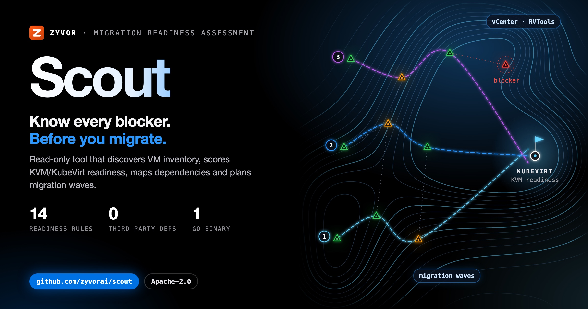
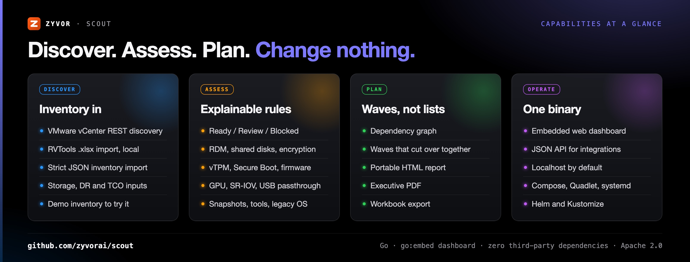
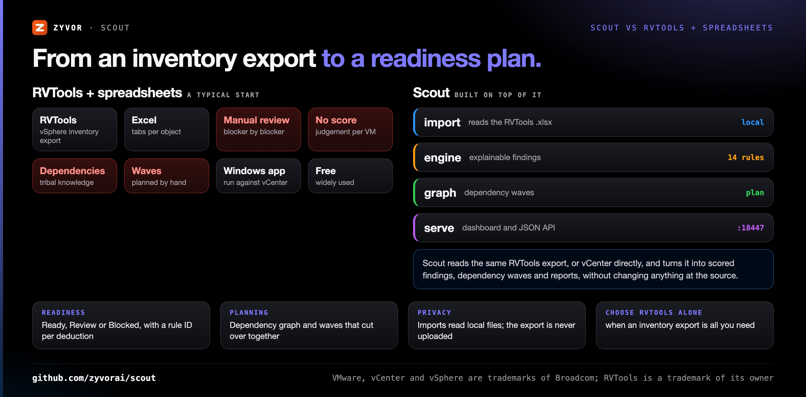
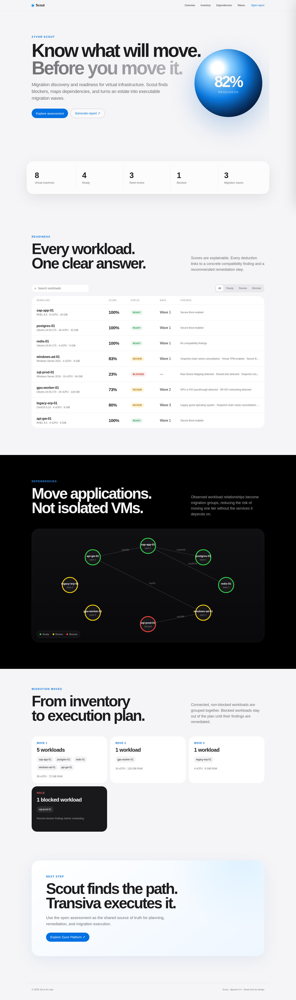
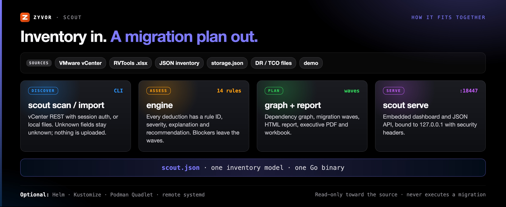

<div align="center">

# Scout

[](https://github.com/zyvorai/scout/actions/workflows/ci.yml)
[](LICENSE)
[](cmd/scout/main.go)
[](go.mod)
[](https://zyvorai.github.io/scout/)

[](https://zyvor.dev/schedule?utm_source=github&utm_medium=scout&utm_campaign=readme_hero)
[](https://zyvor.dev/poc?utm_source=github&utm_medium=scout&utm_campaign=readme_hero)
[](#quickstart)



### Know every blocker. Before you migrate.

**Migration discovery and readiness before migration risk.** Zyvor Scout is a read-only assessment tool for teams planning migrations from virtualized estates to KVM/KubeVirt and other open platforms. It discovers or imports VM inventory, evaluates compatibility, explains blockers, maps dependencies, groups workloads into migration waves, and serves a polished local dashboard from one Go binary.

**14 readiness rules** · **Ready · Review · Blocked** · **Migration waves** · **Read-only, files stay local** · **One Go binary, no third-party dependencies**

📖 **[Read the full docs](https://zyvorai.github.io/scout/)** — quickstart, import formats, architecture, and API.

</div>

> Scout assesses and plans. It does **not** modify source workloads or execute migrations.

---

## Why Scout

| When this happens… | Scout gives you… |
|---|---|
| The migration plan lives in a spreadsheet that hides the hard parts | Explainable findings for RDM/shared disks, vTPM, Secure Boot, passthrough devices, snapshot chains and legacy guests |
| Nobody can say which VMs are ready, only which ones look ready | Every VM starts at 100; each deduction has a rule ID, severity, explanation and recommendation, ending in Ready, Review or Blocked |
| Moving one VM breaks the app it talks to | A dependency graph from the inventory's connections, and migration waves of workloads that cut over together |
| The RVTools export cannot leave the customer network | `scout import` reads RVTools, storage, DR and TCO files locally; nothing is uploaded |
| An assessment tool that writes to vCenter is a non-starter | Read-only discovery; vCenter credentials stay in memory and are never written to inventory or report |
| Leadership wants a summary, engineers want the detail | A portable HTML report, an executive PDF, a workbook export and a JSON API from the same assessment |

Migration projects often begin with spreadsheets that hide the hard parts: RDM/shared disks, vTPM, Secure Boot, passthrough devices, snapshot chains, legacy guests, and application dependencies. Scout turns those facts into an explainable readiness score and an execution-oriented plan.



---

## Scout vs RVTools + spreadsheets



Scout does not replace RVTools; it can read the RVTools workbook and take the analysis from there.

| | **Scout** | **RVTools + spreadsheets** (typical starting point) |
|---|---|---|
| Inventory | vCenter REST discovery, RVTools `.xlsx` import, or JSON | RVTools export of vSphere inventory to Excel |
| Readiness | 14 explainable rules, Ready / Review / Blocked per VM | Reviewed by hand, column by column |
| Blockers | RDM, shared disks, encryption, vTPM, Secure Boot, passthrough, snapshots, firmware, legacy OS, VirtIO | Whatever the reviewer checks for |
| Dependencies and waves | Dependency graph and waves from the inventory's connections | Planned by hand |
| Output | Dashboard, JSON API, HTML report, executive PDF, workbook | The spreadsheet |
| Source access | Read-only; credentials never persisted | Read-only inventory export |
| **Choose RVTools alone when** | | An inventory export is all you need and the team will do the readiness analysis by hand |

---

## See it live



The embedded dashboard served by `scout serve` on `http://127.0.0.1:18447`.

---

## How it fits together



```text
       discovery / JSON import / RVTools
                │
                ▼
           Inventory Model
                │
        ┌───────┴────────┐
        ▼                ▼
  Compatibility       Dependency
     Engine              Graph
        │                │
        └───────┬────────┘
                ▼
        Migration Waves
                │
        ┌───────┴──────────┐
        ▼                  ▼
   JSON API            HTML Report
        │
        ▼
 Embedded Web Dashboard
```

See [docs/ARCHITECTURE.md](docs/ARCHITECTURE.md) for package boundaries and extension points.

---

## Quickstart

Requires Go 1.23+.

```bash
git clone https://github.com/zyvorai/scout.git
cd scout
make build

# Generate a safe demo inventory
./bin/scout scan --source demo --out scout.json

# Print machine-readable assessment
./bin/scout assess --file scout.json

# Open the local dashboard
./bin/scout serve --file scout.json
```

Visit `http://127.0.0.1:18447`.

```bash
./bin/scout report --file scout.json --out report.html
./bin/scout report --file scout.json --executive executive.html --pdf executive.pdf --workbook workbook.zip
```

---

## Capabilities

### Discover

- Demo inventory for safe local evaluation
- VMware vCenter REST discovery (session auth, no guessed fields)
- Strict JSON inventory import
- Local RVTools / storage / DR / TCO inputs ([docs/IMPORT.md](docs/IMPORT.md)) — files stay on the machine that runs Scout

### Assess

- Explainable compatibility rule engine
- Ready / Review / Blocked classification
- Rules for encryption, RDM, shared disks, vTPM, Secure Boot, snapshots, GPU/PCI/USB/SR-IOV passthrough, guest tools, firmware, legacy OS

### Plan

- Dependency graph of connected workloads
- Migration waves that cut over together
- Portable HTML assessment report, executive PDF, workbook export

### Operate

- Zyvor-branded responsive dashboard embedded in one binary
- JSON API for integrations
- Localhost-by-default binding + security headers
- Docker / Podman (Compose + Quadlet), remote systemd deploy, Helm + Kustomize
- Unit and API tests, GitHub Actions CI

## VMware vCenter discovery

Dependency-free vCenter REST connector: API session auth, VM enumeration. v0.1.0 treats fields not returned by the basic VM endpoint as unknown rather than guessing them. Richer hardware/guest collection is on the roadmap.

```bash
export VCENTER_URL='https://vcenter.example.com'
export VCENTER_USERNAME='administrator@vsphere.local'
export VCENTER_PASSWORD='...'

./bin/scout scan --source vmware --out scout.json

# Lab / private PKI only — do not use in production
./bin/scout scan --source vmware --insecure --out scout.json
```

Prefer environment variables so passwords do not land in shell history.

## How scoring works

Every VM begins at 100. Rules emit one of three finding levels:

- **info** — context worth preserving; no readiness penalty by default
- **warning** — needs review or remediation
- **blocker** — excludes the workload from migration waves until resolved

Rules live in `internal/engine/engine.go` and are intentionally simple to extend.

## API

When `scout serve` is running:

| Method | Endpoint | Purpose |
|---|---|---|
| GET | `/api/v1/healthz` | Liveness |
| GET | `/api/v1/inventory` | Source inventory |
| GET | `/api/v1/assessments` | Per-VM readiness |
| GET | `/api/v1/summary` | Aggregate readiness |
| GET | `/api/v1/graph` | Dependency graph |
| GET | `/api/v1/report` | Portable HTML report |
| POST | `/api/v1/analyze` | Analyze supplied inventory without persisting it |

See [docs/API.md](docs/API.md).

## Deploy

```bash
# Podman or Docker (auto-detects)
make container-up

# Remote systemd (cross-compile + SSH + smoke)
./scripts/deploy-remote.sh <host> [user] --port 19726

# Smoke an existing instance
SCOUT_URL=http://<host>:19726 ./scripts/smoke-remote.sh

# Kubernetes
kubectl apply -k deploy/k8s
helm upgrade --install scout deploy/helm/scout -n scout --create-namespace \
  --set-file inventory.json=./scout.json
```

Details: [docs/DEPLOY.md](docs/DEPLOY.md).

## Security model

- Source-side operations are read-only
- vCenter credentials stay in memory — never written to inventory or report
- Server binds to `127.0.0.1:18447` by default
- Conservative timeouts and an 8 MiB analysis-body limit
- CSP, frame, MIME-sniffing, referrer, and permissions headers on the dashboard
- Put Scout behind authenticated TLS termination before exposing it to a network

Read [SECURITY.md](SECURITY.md) before reporting vulnerabilities.

## Development

```bash
make test && make vet && make build
```

## Docs

| Doc | Topic |
|---|---|
| [zyvorai.github.io/scout](https://zyvorai.github.io/scout/) | Product docs |
| [docs/IMPORT.md](docs/IMPORT.md) | RVTools, storage, DR, TCO inputs |
| [docs/ARCHITECTURE.md](docs/ARCHITECTURE.md) | Package boundaries |
| [docs/API.md](docs/API.md) | HTTP API |
| [docs/DEPLOY.md](docs/DEPLOY.md) | Container, remote, Helm |
| [docs/ROADMAP.md](docs/ROADMAP.md) | Next milestones |

Social assets: [docs/social/](docs/social/).

---

## Maturity

Scout is at **v0.1.0**. v0.1.0 treats vCenter fields not returned by the basic VM endpoint as unknown rather than guessing them; richer hardware/guest collection is on the roadmap.

The open-source boundary is **discovery + assessment + dependency planning**. Execution systems can consume Scout's JSON without making Scout responsible for cutover or source mutation.

Planned: richer vSphere hardware collection, libvirt/OpenStack/Hyper-V discovery, guest inspection adapters, traffic-derived dependencies, rule packs, signed assessment bundles, orchestrator export adapters.

See [docs/ROADMAP.md](docs/ROADMAP.md).

---

## Part of the Zyvor stack

| Product | Role next to Scout |
|---|---|
| **Scout** | Read-only discovery, readiness scoring and wave planning |
| **[Transiva](https://github.com/zyvorai/zyvor-transiva)** | Discovers and exports VMs from VMware vSphere and Nutanix AHV, after the plan |
| **[hyper2kvm](https://github.com/zyvorai/hyper2kvm)** | VM migration into KVM |
| **[GuestKit](https://github.com/zyvorai/zyvor-guestkit)** | Guest inspection; Scout marks Windows guests from RVTools for GuestKit inspection of VirtIO state |
| **[Zorvia](https://github.com/zyvorai/zyvor-zorvia)** | KubeVirt VM platform, a migration target |

Scout's JSON is the hand-off point; execution systems consume it without making Scout responsible for cutover. → [zyvor.dev](https://zyvor.dev)

---

## License

Scout is **free and open source** under the [Apache License, Version 2.0](LICENSE) (see [NOTICE](NOTICE)). Personal, lab, and commercial production use at no charge, subject to Apache-2.0 (preserve notices / NOTICE where required). That does not change.

**Zyvor Enterprise** adds what production teams ask for: supported releases, deployment and upgrade guidance, priority incident triage, a named technical contact and 24x7 critical intake. Plans and terms: [docs/SUBSCRIPTION-MODEL.md](docs/SUBSCRIPTION-MODEL.md) · [Pricing](https://zyvor.dev/pricing?utm_source=github&utm_medium=scout&utm_campaign=readme_license) · [sales@zyvor.dev](mailto:sales@zyvor.dev).

Read [SECURITY.md](SECURITY.md) before reporting vulnerabilities. Contributing: [CONTRIBUTING.md](CONTRIBUTING.md).

---

<div align="center">

### Find the blockers before your cutover does

[](https://zyvor.dev/schedule?utm_source=github&utm_medium=scout&utm_campaign=readme_footer)
[](https://zyvor.dev/poc?utm_source=github&utm_medium=scout&utm_campaign=readme_footer)
[](https://zyvor.dev/pricing?utm_source=github&utm_medium=scout&utm_campaign=readme_footer)
[](mailto:sales@zyvor.dev?subject=Scout)
[](https://github.com/zyvorai/scout)

</div>
